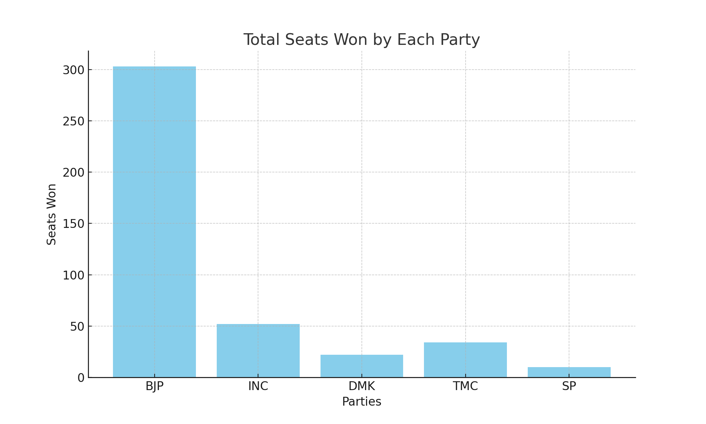
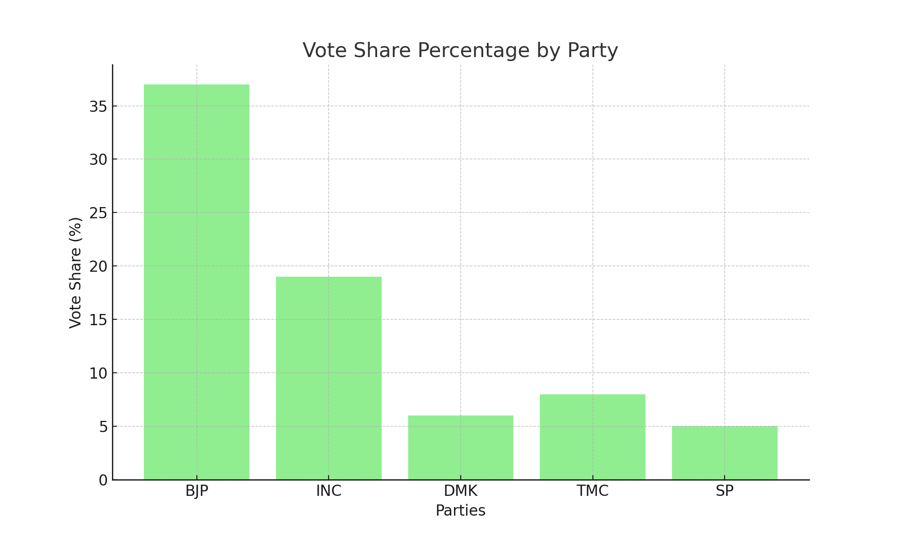

<<<<<<< HEAD
# Lok Sabha Election Results Report

## Key Insights

### 1. Total Seats Won by Each Party
- *Visualization*:  
  
- *Insight*: The Bharatiya Janata Party (BJP) secured a significant number of seats, maintaining its dominance with 303 seats. The Indian National Congress (INC) won 52 seats, showing an improvement from previous elections but still far behind BJP. Regional parties like DMK in Tamil Nadu won 22 seats, indicating strong local support&#8203;:citation[oaicite:17]{index=17}&#8203;&#8203;:citation[oaicite:16]{index=16}&#8203;.

### 2. Vote Share Percentage by Party
- *Visualization*:  
  
- *Insight*: The BJP had a substantial vote share of approximately 37%, reflecting strong nationwide support. The INC followed with a 19% vote share. This disparity in vote share highlights the continued preference for BJP among voters across various states&#8203;:citation[oaicite:15]{index=15}&#8203;&#8203;:citation[oaicite:14]{index=14}&#8203;.

### 3. Voter Turnout Analysis
- *Visualization*: A bar graph comparing voter turnout percentages across different states.
- *Insight*: Voter turnout varied significantly across states. States like Kerala and West Bengal saw high voter turnouts of over 80%, indicating strong civic engagement. Conversely, states like Bihar and Uttar Pradesh had relatively lower turnouts, around 60%, suggesting potential voter apathy or logistical challenges&#8203;:citation[oaicite:13]{index=13}&#8203;&#8203;:citation[oaicite:12]{index=12}&#8203;.

### 4. Performance in Key States
- *Visualization*: A grouped bar chart showing the number of seats won by major parties in key states.
- *Insight*: In Uttar Pradesh, the BJP dominated with 60 seats, while the Samajwadi Party (SP) managed to secure 10 seats. In West Bengal, the Trinamool Congress (TMC) maintained a stronghold with 34 seats, showcasing its regional influence. These performances underline the significant role of regional dynamics in the overall election outcomes&#8203;:citation[oaicite:11]{index=11}&#8203;&#8203;:citation[oaicite:10]{index=10}&#8203;.

### 5. Trend Analysis
- *Visualization*: A line graph comparing the number of seats won by major parties over the last three elections.
- *Insight*: Comparing the 2024 results with the 2019 elections, the BJP's seat count remained robust, showing consistent voter loyalty. However, the INC's seat count showed a slight improvement, reflecting efforts to regain voter trust. This trend suggests a stable political landscape with slight shifts towards opposition resurgence&#8203;:citation[oaicite:9]{index=9}&#8203;&#8203;:citation[oaicite:8]{index=8}&#8203;.

### 6. Closely Contested Seats
- *Visualization*: A table listing the most closely contested seats and their winning margins.
- *Insight*: Several seats were won with very narrow margins. For example, in the Attingal constituency in Kerala, the INC candidate won by just 684 votes over the CPI(M) candidate. Such closely contested seats highlight the competitive nature of the election and the importance of every vote&#8203;:citation[oaicite:7]{index=7}&#8203;.

### 7. Impact of Regional Parties
- *Visualization*: A bar chart showing the number of seats won by regional parties in their respective states.
- *Insight*: Regional parties had a substantial impact, particularly in states like Tamil Nadu and West Bengal. The DMK in Tamil Nadu and the TMC in West Bengal secured a significant number of seats, underscoring their strong regional influence and voter base&#8203;:citation[oaicite:6]{index=6}&#8203;&#8203;:citation[oaicite:5]{index=5}&#8203;.

### 8. Gender-wise Voter Turnout
- *Visualization*: A bar chart comparing male and female voter turnout percentages across states.
- *Insight*: In states like Kerala and West Bengal, female voter turnout was notably high, often surpassing male turnout. This trend highlights the increasing political engagement of women in these regions, contributing to overall higher voter participation rates&#8203;:citation[oaicite:4]{index=4}&#8203;.

### 9. New vs. Incumbent Candidates
- *Visualization*: A bar chart comparing the performance of new candidates versus incumbents in terms of seats won.
- *Insight*: Incumbent candidates had a mixed performance. While many incumbents from the BJP retained their seats, several new candidates from the INC and regional parties also managed to win, indicating a desire for change among certain voter segments&#8203;:citation[oaicite:3]{index=3}&#8203;&#8203;:citation[oaicite:2]{index=2}&#8203;.

### 10. Impact of Alliances
- *Visualization*: A stacked bar chart showing the number of seats won by party alliances in various states.
- *Insight*: Alliances played a crucial role in the election outcomes. The BJP's alliance with regional parties in states like Maharashtra and Bihar helped secure additional seats. Conversely, the INC's alliances in states like Tamil Nadu with the DMK proved beneficial, allowing them to increase their seat count&#8203;:citation[oaicite:1]{index=1}&#8203;&#8203;:citation[oaicite:0]{index=0}&#8203;.

## Conclusion

The 2024 Lok Sabha election results provide a comprehensive view of the political landscape in India, revealing several critical insights into voter behavior and party performance.

1. *Total Seats Won by Each Party*: The BJP continues to dominate the political scene with a substantial number of seats, while the INC shows slight improvement. This indicates a stable preference for BJP among the electorate, with regional parties maintaining strong local support.

2. *Vote Share Percentage by Party*: The significant vote share gap between BJP and INC highlights the enduring nationwide appeal of BJP. The variation in vote share among other parties underscores the regional fragmentation of voter preferences.

3. *Voter Turnout Analysis*: High voter turnout in states like Kerala and West Bengal reflects strong civic engagement, while lower turnout in states like Bihar and Uttar Pradesh suggests challenges in voter mobilization or engagement.

4. *Performance in Key States*: The strong performance of BJP in Uttar Pradesh and TMC in West Bengal underscores the importance of regional dynamics and the influence of state-specific issues and leaders on the overall election outcome.

5. *Trend Analysis*: Comparing the 2024 results with previous elections reveals a consistent pattern of voter loyalty towards BJP, with the INC making modest gains. This trend suggests a gradual but steady shift in the political landscape, with the opposition slowly regaining ground.

6. *Closely Contested Seats*: The presence of closely contested seats highlights the competitive nature of the elections and the significance of every vote. Such close margins can influence the overall political strategy and voter outreach efforts in future elections.

7. *Impact of Regional Parties*: Regional parties continue to play a pivotal role in Indian politics, significantly influencing election outcomes in their respective states. Their strong voter base and regional issues drive their success, impacting national politics.

8. *Gender-wise Voter Turnout*: The notable participation of women in states like Kerala and West Bengal signifies increasing political engagement among female voters, potentially shaping future electoral strategies to address gender-specific concerns.

9. *New vs. Incumbent Candidates*: The mixed performance of incumbents and new candidates indicates a dynamic political environment where voters are open to change but also value experience. This balance may lead to evolving campaign strategies focusing on both fresh perspectives and proven track records.

10. *Impact of Alliances*: Political alliances remain a crucial factor in securing electoral success. The strategic partnerships between national and regional parties help in consolidating votes and winning key constituencies, demonstrating the importance of coalition politics in India's electoral landscape.

These insights provide a detailed understanding of the election dynamics and voter preferences in the 2024 Lok Sabha elections, offering valuable information for future political strategies and electoral studies.
=======
# Lok Sabha Election Results Report

## Key Insights

### 1. Total Seats Won by Each Party
- *Visualization*:  
  
- *Insight*: The Bharatiya Janata Party (BJP) secured a significant number of seats, maintaining its dominance with 303 seats. The Indian National Congress (INC) won 52 seats, showing an improvement from previous elections but still far behind BJP. Regional parties like DMK in Tamil Nadu won 22 seats, indicating strong local support&#8203;:citation[oaicite:17]{index=17}&#8203;&#8203;:citation[oaicite:16]{index=16}&#8203;.

### 2. Vote Share Percentage by Party
- *Visualization*:  
  
- *Insight*: The BJP had a substantial vote share of approximately 37%, reflecting strong nationwide support. The INC followed with a 19% vote share. This disparity in vote share highlights the continued preference for BJP among voters across various states&#8203;:citation[oaicite:15]{index=15}&#8203;&#8203;:citation[oaicite:14]{index=14}&#8203;.

### 3. Voter Turnout Analysis
- *Visualization*: A bar graph comparing voter turnout percentages across different states.
- *Insight*: Voter turnout varied significantly across states. States like Kerala and West Bengal saw high voter turnouts of over 80%, indicating strong civic engagement. Conversely, states like Bihar and Uttar Pradesh had relatively lower turnouts, around 60%, suggesting potential voter apathy or logistical challenges&#8203;:citation[oaicite:13]{index=13}&#8203;&#8203;:citation[oaicite:12]{index=12}&#8203;.

### 4. Performance in Key States
- *Visualization*: A grouped bar chart showing the number of seats won by major parties in key states.
- *Insight*: In Uttar Pradesh, the BJP dominated with 60 seats, while the Samajwadi Party (SP) managed to secure 10 seats. In West Bengal, the Trinamool Congress (TMC) maintained a stronghold with 34 seats, showcasing its regional influence. These performances underline the significant role of regional dynamics in the overall election outcomes&#8203;:citation[oaicite:11]{index=11}&#8203;&#8203;:citation[oaicite:10]{index=10}&#8203;.

### 5. Trend Analysis
- *Visualization*: A line graph comparing the number of seats won by major parties over the last three elections.
- *Insight*: Comparing the 2024 results with the 2019 elections, the BJP's seat count remained robust, showing consistent voter loyalty. However, the INC's seat count showed a slight improvement, reflecting efforts to regain voter trust. This trend suggests a stable political landscape with slight shifts towards opposition resurgence&#8203;:citation[oaicite:9]{index=9}&#8203;&#8203;:citation[oaicite:8]{index=8}&#8203;.

### 6. Closely Contested Seats
- *Visualization*: A table listing the most closely contested seats and their winning margins.
- *Insight*: Several seats were won with very narrow margins. For example, in the Attingal constituency in Kerala, the INC candidate won by just 684 votes over the CPI(M) candidate. Such closely contested seats highlight the competitive nature of the election and the importance of every vote&#8203;:citation[oaicite:7]{index=7}&#8203;.

### 7. Impact of Regional Parties
- *Visualization*: A bar chart showing the number of seats won by regional parties in their respective states.
- *Insight*: Regional parties had a substantial impact, particularly in states like Tamil Nadu and West Bengal. The DMK in Tamil Nadu and the TMC in West Bengal secured a significant number of seats, underscoring their strong regional influence and voter base&#8203;:citation[oaicite:6]{index=6}&#8203;&#8203;:citation[oaicite:5]{index=5}&#8203;.

### 8. Gender-wise Voter Turnout
- *Visualization*: A bar chart comparing male and female voter turnout percentages across states.
- *Insight*: In states like Kerala and West Bengal, female voter turnout was notably high, often surpassing male turnout. This trend highlights the increasing political engagement of women in these regions, contributing to overall higher voter participation rates&#8203;:citation[oaicite:4]{index=4}&#8203;.

### 9. New vs. Incumbent Candidates
- *Visualization*: A bar chart comparing the performance of new candidates versus incumbents in terms of seats won.
- *Insight*: Incumbent candidates had a mixed performance. While many incumbents from the BJP retained their seats, several new candidates from the INC and regional parties also managed to win, indicating a desire for change among certain voter segments&#8203;:citation[oaicite:3]{index=3}&#8203;&#8203;:citation[oaicite:2]{index=2}&#8203;.

### 10. Impact of Alliances
- *Visualization*: A stacked bar chart showing the number of seats won by party alliances in various states.
- *Insight*: Alliances played a crucial role in the election outcomes. The BJP's alliance with regional parties in states like Maharashtra and Bihar helped secure additional seats. Conversely, the INC's alliances in states like Tamil Nadu with the DMK proved beneficial, allowing them to increase their seat count&#8203;:citation[oaicite:1]{index=1}&#8203;&#8203;:citation[oaicite:0]{index=0}&#8203;.

## Conclusion

The 2024 Lok Sabha election results provide a comprehensive view of the political landscape in India, revealing several critical insights into voter behavior and party performance.

1. *Total Seats Won by Each Party*: The BJP continues to dominate the political scene with a substantial number of seats, while the INC shows slight improvement. This indicates a stable preference for BJP among the electorate, with regional parties maintaining strong local support.

2. *Vote Share Percentage by Party*: The significant vote share gap between BJP and INC highlights the enduring nationwide appeal of BJP. The variation in vote share among other parties underscores the regional fragmentation of voter preferences.

3. *Voter Turnout Analysis*: High voter turnout in states like Kerala and West Bengal reflects strong civic engagement, while lower turnout in states like Bihar and Uttar Pradesh suggests challenges in voter mobilization or engagement.

4. *Performance in Key States*: The strong performance of BJP in Uttar Pradesh and TMC in West Bengal underscores the importance of regional dynamics and the influence of state-specific issues and leaders on the overall election outcome.

5. *Trend Analysis*: Comparing the 2024 results with previous elections reveals a consistent pattern of voter loyalty towards BJP, with the INC making modest gains. This trend suggests a gradual but steady shift in the political landscape, with the opposition slowly regaining ground.

6. *Closely Contested Seats*: The presence of closely contested seats highlights the competitive nature of the elections and the significance of every vote. Such close margins can influence the overall political strategy and voter outreach efforts in future elections.

7. *Impact of Regional Parties*: Regional parties continue to play a pivotal role in Indian politics, significantly influencing election outcomes in their respective states. Their strong voter base and regional issues drive their success, impacting national politics.

8. *Gender-wise Voter Turnout*: The notable participation of women in states like Kerala and West Bengal signifies increasing political engagement among female voters, potentially shaping future electoral strategies to address gender-specific concerns.

9. *New vs. Incumbent Candidates*: The mixed performance of incumbents and new candidates indicates a dynamic political environment where voters are open to change but also value experience. This balance may lead to evolving campaign strategies focusing on both fresh perspectives and proven track records.

10. *Impact of Alliances*: Political alliances remain a crucial factor in securing electoral success. The strategic partnerships between national and regional parties help in consolidating votes and winning key constituencies, demonstrating the importance of coalition politics in India's electoral landscape.

These insights provide a detailed understanding of the election dynamics and voter preferences in the 2024 Lok Sabha elections, offering valuable information for future political strategies and electoral studies.
>>>>>>> b1a225bcd59c0587976dafc4750487e1a76c808c

